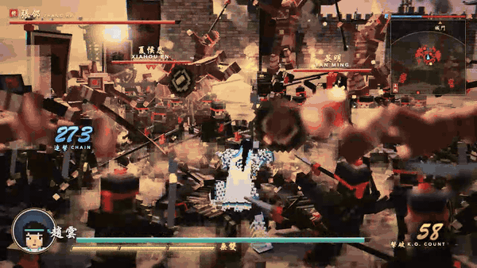
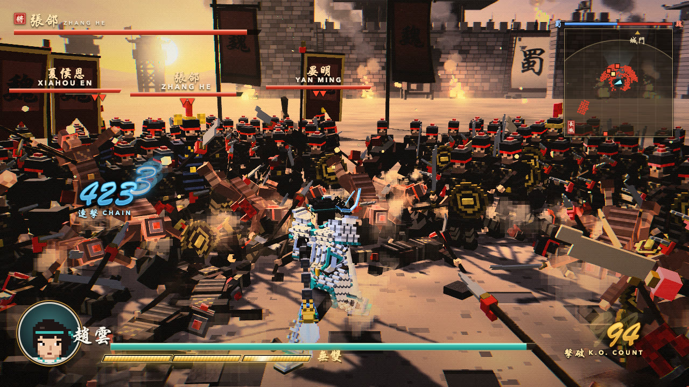
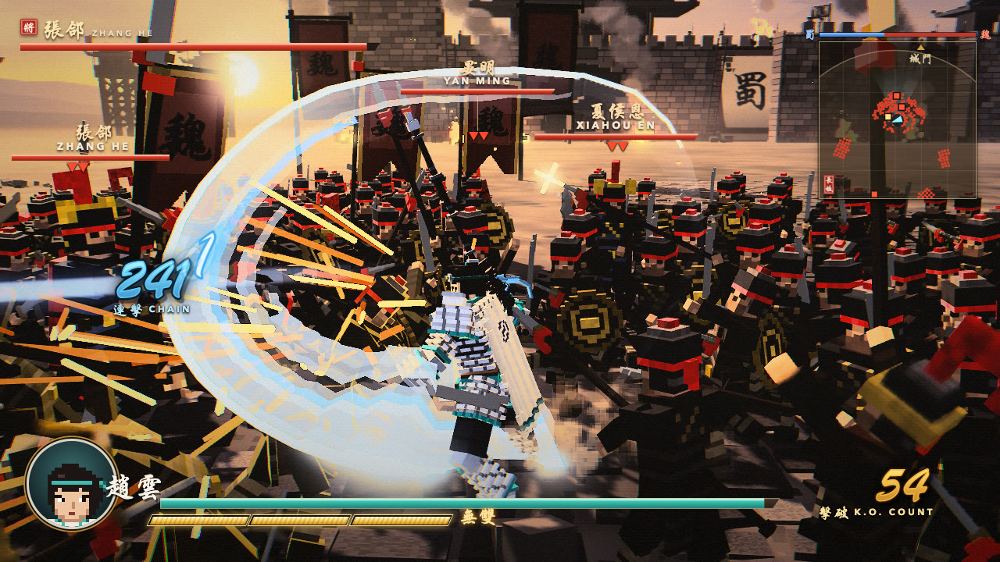
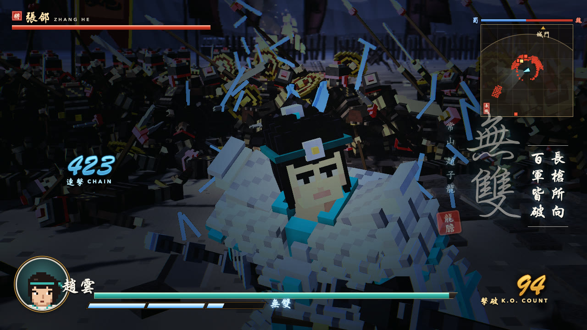
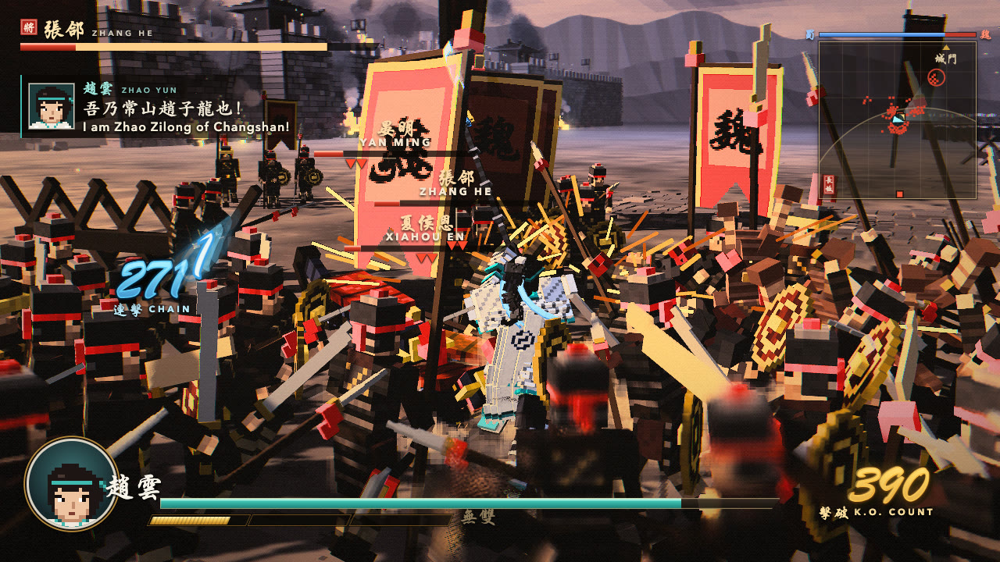
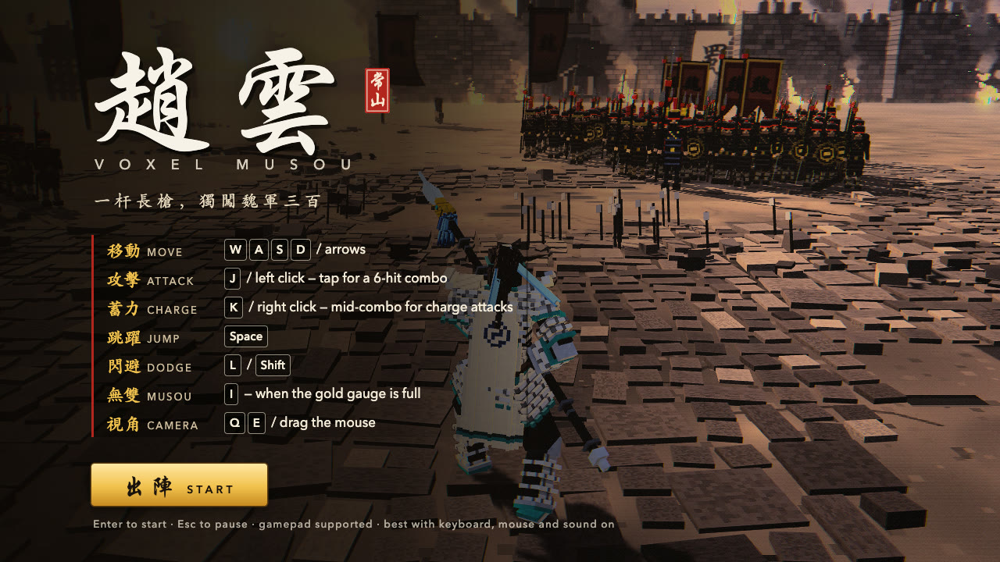

**English** | [简体中文](README.zh-CN.md) | [日本語](README.ja.md)

# Voxel Musou — Zhao Yun (趙雲)

<p align="center">
  <a href="https://voxel-musou.vercel.app"></a>
</p>

<p align="center"><b><a href="https://voxel-musou.vercel.app">▶ Play in your browser — voxel-musou.vercel.app</a></b></p>

| | |
| --- | --- |
|  |  |
| Crowd fight, 400+ hit chain | Charge sweep |
|  |  |
| Musou cut-in | Musou dragon, 150 K.O. |

A browser-playable voxel action game in the style of Dynasty Warriors, built with Three.js. Take the field as Zhao Yun and cut through hundreds of Wei soldiers with his spear.

No build step: plain ES modules, Three.js r186 vendored in `vendor/three/`, deterministic fixed 60 Hz simulation.

## Features

- Flowing normal combos (N1–N6) and charge attacks (C1–C6)
- Jump, jump attack and dodge
- Hit-stop and impact VFX
- Dense voxel crowds of Wei soldiers (~300, InstancedMesh) blasted apart into voxel debris
- Enemy officers with name and HP tags
- Musou special attack with a dragon and screen color grade
- Golden-hour castle battlefield with fires and banners
- Custom post-processing: atmospheric haze, depth of field, bloom, retro pixel look
- Procedural WebAudio sound
- Calligraphy-style HUD

## Run

ES modules don't load from `file://`, so serve the folder with any static server:

```sh
python3 -m http.server 8000
```

Then open http://localhost:8000 . Requires a WebGL2 browser; a desktop GPU is recommended. Sound starts on the first key press or click.

## Controls

Keyboard and mouse; a gamepad is optional.

| Action | Keys |
| --- | --- |
| Move (camera-relative) | WASD / arrow keys |
| Normal attack | J / left mouse |
| Charge attack | K / right mouse |
| Jump | Space |
| Dodge | L / Shift |
| Musou | I |
| Camera orbit | mouse drag / Q E |
| Pause / controls | Esc |
| Start | Enter / click 出陣 |



## Options

| URL parameter | Description |
| --- | --- |
| `?enemies=N` | Number of enemy soldiers, 0–2000 (default 300) |

## Project layout

```
index.html      entry point, importmap, HUD CSS
src/            core, hero, combat, crowd, musou, camera, vfx, post, world, audio, ui
vendor/three/   Three.js r186
media/          README screenshots and GIF
```

## Credits & License

- Code: MIT, see [LICENSE](LICENSE).
- [three.js](https://threejs.org/): MIT.
- HUD fallback font `src/ui/brush.woff2` is a subset of Yuji Boku by Kinuta Font Factory, licensed under the SIL Open Font License 1.1.

This is a fan project, not affiliated with or endorsed by KOEI TECMO. "Dynasty Warriors" is a trademark of KOEI TECMO. No game assets from the original games are included.
